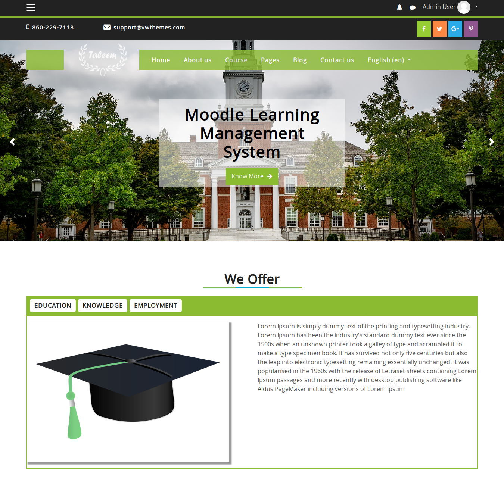

The "Taleem" Moodle Theme
============================

About Taleem Moodle theme
============================
Taleem is a fully responsive Moodle theme well suited for Universities,Schools & Online learning websites.

    Relesed on :   30 November 2018
    Authors :   VWThemes
    Copyright © 2018 onwards www.vwthemes.com

Supported moodle versions
============================
Compatible with Moodle 3.2+

Taleem theme - Installation steps
============================
    On your download pacakge, you will find theme_taleem.zip
    Unzip - theme_taleem.zip, you will get folder 'taleem'
    Copy folder 'taleem' and put into theme folder of your moodle system
    Next login as Site administrator
    Go to 'Site administration' -> 'Notifications' , here on 'Plugins check' page you will see the taleem theme in listing.
    Click the "Upgrade Moodle database now" button displayed on bottom of the page
    You will get success message once the theme installed successfully.
    By clicking "Continue" button on success page , you will get options to change the taleem theme settings.
    You can modify the settings later too

Steps to set Taleem theme as default theme for your moodle system
============================
    Login as site administrator
    Go to Site administration -> Appearance -> Themes -> Theme selector
    Click the "Change theme" button for device type as "Default"
    It will list all the available themes for "Default device"
    Then click "Use theme" button on "Taleem theme"
    Next click the "Continue" button ,thats it.
    Cheers,you have done it !!!
    If you need any support related to this theme , kindly send a mail to info@vwthemes.com

